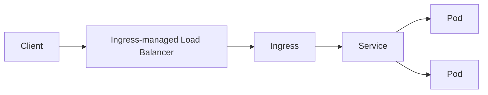
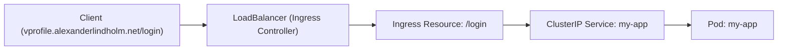

# [Ingress](https://kubernetes.io/docs/concepts/services-networking/ingress/)

## What is Ingress ?

Ingress exposes HTTP and HTTPS routes from outside the cluster to services within the cluster.



## Prerequisites

You must have an Ingress controller to satisfy an Ingress. Only creating an Ingress resource has no effect.

Ingress Controllers List

- AKS Application Gateway Ingress Controller
- Apache APISIX ingress controller
- Avi Kubernetes Operator
- NGINX Ingress Controller for Kubernetes
- [And many many more](https://kubernetes.io/docs/concepts/services-networking/ingress-controllers/)

## Hands On: [Install Nginx Ingress](https://kubernetes.github.io/ingress-nginx/deploy/#aws)

```shell
kubectl apply -f https://raw.githubusercontent.com/kubernetes/ingress-nginx/controller-v1.12.3/deploy/static/provider/aws/deploy.yaml
```

```shell
kubectl get ns
# ingress-nginx    Active    12s
```

```shell
kubectl get all -n ingress-nginx
```

```bash
NAME                                           READY   STATUS      RESTARTS   AGE
pod/ingress-nginx-admission-create-12345       0/1     Completed   0          23s
pod/ingress-nginx-admission-patch-12345        0/1     Completed   1          23s
pod/ingress-nginx-controller-69fbbf9f9c-h67pr  0/1     Running     0          23s
NAME                                        TYPE           CLUSTER-IP       EXTERNAL-IP                                                      PORT(S)                       AGE
service/ingress-nginx-controller            LoadBalancer   100.68.173.127   a07bff36074ee45d6a8ab27eb91b1f83-f.elb.us-west-2.amazonaws.com   80:32718/TCP, 443:32372/TCP   23s
service/ingress-nginx-controller-admission  ClusterIP      100.66.154.8     <none>                                                           443/TCP                       23s

NAME                                        READY   UP-TO-DATE   AVAILABLE   AGE
deployment.apps/ingress-nginx-controller    1/1     1            1           23s

NAME                                                  DESIRED   CURRENT   READY   AGE
replicaset.apps/ingress-nginx-controller-69fbfbf9f9c  1         1         1    23s

NAME                                           COMPLETIONS   DURATION   AGE
job.batch/ingress-nginx-admission-create       1/1           3s         23s
job.batch/ingress-nginx-admission-patch        1/1           4s         23s

```

In this example the credentials are:

- External DNS (Load Balancer): 
    - `a07bff36074ee45d6a8ab27eb91b1f83-f.elb.us-west-2.amazonaws.com`
- Internal IP (Load Balancer): `100.68.173.127`
- Internal IP (Cluster IP): `100.66.154.8`
- Ingress routing (following your defined rules): 
    - `pod/ingress-nginx-controller-69fbbf9f9c-h67pr`
- Deployment: `deployment.apps/ingress-nginx-controller`
- Replica set: `replicaset.apps/ingress-nginx-controller-69fbfbf9f9c`
- Jobs:
    - `job.batch/ingress-nginx-admission-create`
    - `job.batch/ingress-nginx-admission-patch`

This commands will create a loadbalancer in ROUTE 53 (AWS Cloud)

```shell
vim vprodep.yaml
```
```yaml
apiVersion: apps/v1
kind: Deployment
metadata:
  name: my-app
spec:
  selector:
    matchLabels:
      run: my-app
  replicas: 1
  template:
    metadata:
      labels:
        run: my-app
    spec:
      containers:
        - name: my-app
          image: imranvisualpath/vproappfix
          ports:
            - containerPort: 8080
```

```shell
vim vprosvc.yaml
```

```yaml
apiVersion: v1
kind: Service
metadata:
  name: my-app
spec:
  ports:
    - port: 8080
      protocol: TCP
      targetPort: 8080
  selector:
    run: my-app
  type: ClusterIP
```

```shell
vim vproingress.yaml
```

```yaml
apiVersion: networking.k8s.io/v1
kind: Ingress
metadata:
  name: vpro-ingress
  annotations:
    nginx.ingress.kubernetes.io/use-regex: "true"
spec:
  ingressClassName: nginx
  rules:
    - host: vprofile.alexanderlindholm.net
      http:
        paths:
          - path: /login
            pathType: Prefix
            backend:
              service:
                name: my-app
                port:
                  number: 8080
```

replace `alexanderlindholm.net` with your DNS name

```shell
kubectl apply -f vprodep.yaml
```

```shell
kubectl apply -f vprosvc.yaml
```

**Create DNS CNAME before Applying `vproingress.yaml`**


Visit your DNS provider, in my case it will be [Namecheap](https://www.namecheap.com/)

1. Go to DNS records section (Advanced DNS for Namecheap)

2. Apply this credentials:
    - `TYPE: CNAME`
    - `Name: vprofile`
    - `Value: a07bff36074ee45d6a8ab27eb91b1f83-f.elb.us-west-2.amazonaws.com`

Check if my-app service is running:

```shell
kubectl get svc
# my-app    ClusterIP    100.69.158.126    <none>    8080/TCP    120s
kubectl describe svc my-app
```

Keep in mind that we are creating Ingress rule for this ClusterIP Service

1. Client makes an HTTP request to:
http://vprofile.alexanderlindholm.net/login
(This DNS name resolves to the External IP/DNS of the Ingress LoadBalancer.)
2. The request hits the Ingress Controller (NGINX) via the LoadBalancer, which processes the request using the rules defined in your Ingress resource.
It then forwards the request to the my-app Service (which is of type ClusterIP).
3. The ClusterIP Service (my-app) routes the traffic to one of the backing Pods (using label selectors), and the application running in the pod responds.



```shell
kubectl apply -f vproingress.yaml
```

```shell
kubectl get ingress
# vpro-ingress   nginx   vprofile.alexanderlindholm.net   a07bff36074ee45d6a8ab27eb91b1f83-f.elb.us-west-2.amazonaws.com
```

Visit page at: `a07bff36074ee45d6a8ab27eb91b1f83-f.elb.us-west-2.amazonaws.com`.

This URL would be different for you.

```shell
kubectl delete ingress vpro-ingress
```

## Optional: Change app path to fix content rendering on the page

The page is not rendering becouse the routing is happening internally not in the app

```shell
vim vproingress.yaml
# change /login to /
```

```shell
kubectl apply -f vproingress.yaml && kubectl get ingress --watch
```

## Delete

```shell
kubectl get ns
kubectl apply -f https://raw.githubusercontent.com/kubernetes/ingress-nginx/controller-v1.12.3/deploy/static/provider/aws/deploy.yaml
```
