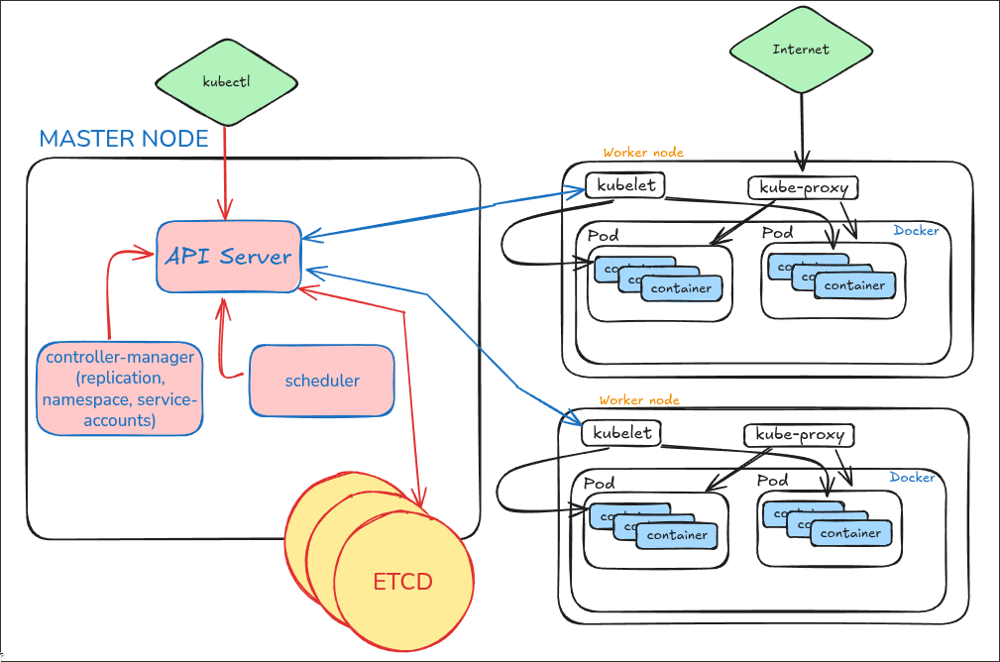
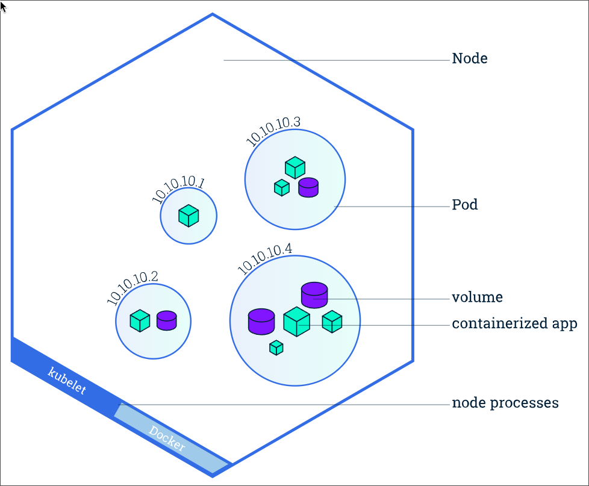

# Introduction to Kubernetes?

If the Docker Engine fails, **all containers running on that engine will go down**, making them inaccessible to users.

This is where **Kubernetes** comes in — it manages **multiple Docker Engines**, known as **Docker nodes**, within a Kubernetes cluster. This setup ensures **high availability** and fault tolerance.

For example, if a container on the third node fails, Kubernetes automatically **reschedules and migrates** that container to a healthy node in the cluster.

---

## 🧠 Container Orchestration

Container orchestration refers to managing the **deployment, scaling, networking, and availability** of containers across a **cluster of Docker/worker nodes**.

In Kubernetes, these nodes form a **single pool of compute resources** that is **fault-tolerant and self-healing**.

---

## 🔧 Popular Container Orchestration Tools

- **Docker Swarm**
- **Kubernetes** 🌟
- **Mesosphere Marathon**
- **AWS ECS & EKS**
- **Azure Container Service**
- **Google Kubernetes Engine (GKE)**
- **CoreOS Fleet**
- **OpenShift**

---

## 🚀 What Kubernetes Provides

- **Service Discovery & Load Balancing**  
  Automatically exposes containers using DNS names or IPs and distributes traffic across them.

- **Storage Orchestration**  
  Mounts persistent storage from local disks or cloud providers like:
  - SAN (Storage Area Network)
  - NAS (Network Attached Storage)
  - AWS EBS volumes
  - Ceph

- **Automated Rollouts & Rollbacks**  
  Gradually updates applications and rolls back if something goes wrong.

- **Automatic Bin Packing**  
  Places containers based on resource requirements and availability to maximize efficiency.

- **Self-Healing**  
  Automatically restarts failed containers, replaces unresponsive nodes, and kills misbehaving containers.

- **Secrets & Configuration Management**  
  Manages sensitive data like passwords, SSH keys, and environment variables securely and separately from your application code.

---

## 📊 Kubernetes Architecture

[link to model](https://excalidraw.com/#json=AKcO9sSmoO8eI4anTIIAq,ZcPm7b1_DE7u62HJ0Qa31Q)

---

## 🎛 Components

---

### 🧠 Master Component: Kube API Server

- Acts as the **central communication hub** for all Kubernetes components.
- **Exposes the Kubernetes API**, making it the frontend of the control plane.
- Handles all **external and internal requests**, including scheduling, deployments, and health checks.
- Admins interact with it via the **`[kubectl](https://kubernetes.io/docs/reference/kubectl/)` CLI** or through automated systems.
- A **web-based dashboard** can be integrated using the API.
- Enables integration with third-party tools and services like CI/CD, monitoring, and more.

---

### 💾 Master: etcd Server

- Stores **all cluster data** for the Kubernetes control plane.
- A **consistent and highly available** key-value store that serves as Kubernetes' backing store.
- The **Kube API Server retrieves and writes data** to etcd.
- It should be **backed up regularly** to ensure disaster recovery.
- Maintains the **current state** of all objects in the cluster (nodes, pods, configs, etc.).

---

### 📦 Master: Kube Scheduler

- **Monitors newly created pods** that do not yet have an assigned node.
- **Selects the most suitable node** for each pod to run on.
- Key factors considered during scheduling include:
  - Resource requirements (CPU, memory)
  - Hardware/software/policy constraints
  - Affinity and anti-affinity rules
  - Data locality
  - Inter-workload interference
  - Deadlines and priorities

---

### 🧩 Master: Controller Manager

Logically, each controller is a separate process.  
However, to reduce complexity, they are all **compiled into a single binary** and run in a single process: the **kube-controller-manager**.

These controllers include:

- **Node Controller**  
  Detects and responds when nodes become unresponsive or go offline.

- **Replication Controller**  
  Ensures the correct number of pod replicas are running for each replication controller object in the cluster.

- **Endpoint Controller**  
  Populates the `Endpoints` object, connecting **Services** to their corresponding **Pods**.

- **Service Account & Token Controller**  
  Automatically creates **default service accounts** and **API tokens** for newly created namespaces.

---

### 🧱 Node Components

#### 📌 Kubelet
- An agent that runs on **every node** in the cluster.
- Ensures that the containers described in the PodSpec are **running and healthy**.
- Communicates with the **Kube API Server** to receive instructions and report status.

#### 🌐 Kube Proxy
- A **network proxy** that also runs on each node in the cluster.
- Maintains **network rules** on nodes, allowing:
  - Communication **between Pods** within the cluster
  - External access to **Services** from outside the cluster
- Handles **TCP/UDP forwarding** and supports virtual IPs via iptables or IPVS.

#### 🔧 Container Runtime
- The software responsible for **running containers** on each node.
- Kubernetes supports multiple container runtimes via the **Container Runtime Interface (CRI)**, including:
  - **Docker**
  - **containerd**
  - **CRI-O**
  - **rktlet** (now deprecated)

---

### 📦 PODS

*(Reference: Imran Teli)*

---

### 🧩 Addons

Kubernetes supports a variety of addons that extend its core functionality:

- **DNS**  
  Provides name resolution for services and pods within the cluster.

- **Web UI (Dashboard)**  
  A web-based interface for managing and visualizing the cluster.

- **Container Resource Monitoring**  
  Tracks usage metrics like CPU, memory, and disk for containers.

- **Cluster-Level Logging**  
  Collects and stores logs from all cluster components for debugging and auditing.

---

## ⚙️ Kubernetes Setup Tools

### 🛠️ The Hard Way (Manual Setup)
- Full manual installation of Kubernetes components (used for learning and deep understanding).
- Requires setting up etcd, API server, controller manager, scheduler, kubelet, and kube-proxy manually.

### 🧪 [Minikube](https://minikube.sigs.k8s.io/)
- Creates a **single-node Kubernetes cluster** on your local machine.
- Great for testing, development, and learning.

### ⚡ [Kubeadm](https://kubernetes.io/docs/reference/setup-tools/kubeadm/)
- Tool to easily set up **multi-node Kubernetes clusters**.
- Platform-agnostic: works on **VMs, EC2 instances, physical machines**, and more.
- Handles essential steps like initializing the cluster and joining nodes.

### ☁️ [Kops](https://kops.sigs.k8s.io/)
- Used for deploying **production-grade multi-node Kubernetes clusters on AWS**.
- Supports HA (High Availability) setups, upgrades, and more.

---

## 📘 What's Next?

- [Kubernetes History](./history.md)
- [Setup kubernetes on Raspberry PI](https://gitlab.com/lindholmalex.la/kubernetes_raspberry_pi/-/tree/main?ref_type=heads)