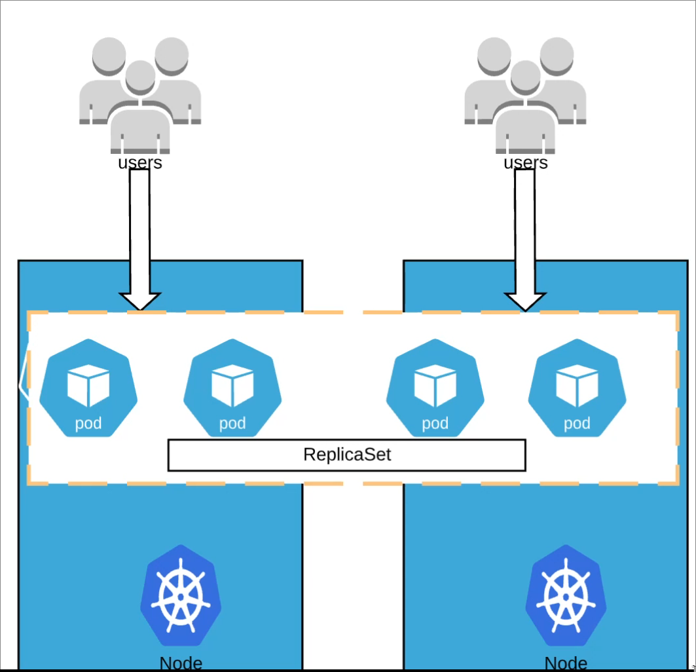

# ReplicaSet

## Problem

If a pod is running a web application and the pod goes down, then users won't be able to access the data.

Somone would need to log in and fix the problem, but this takes time.

## ReplicaSet

If a pod crashes, it will create a new pod automatically with a health check.

A ReplicaSet can be used to scale the number of pods.



## Example YAML

`vim sampleReplicaSet.yaml`:

```yaml
apiVersion: apps/v1
kind: ReplicaSet
metadata:
  name: frontend
  labels:
    app: guestbook
    tier: frontend
spec:
  # modify replicas according to your case
  replicas: 3
  selector:
    matchLabels:
      tier: frontend
  template:
    metadata:
      labels:
        tier: frontend
    spec:
      containers:
        - name: php-redis
          image: gcr.io/google_samples/gb-frontend:v3
```

## Commands

create replica:
```bash
kubectl create -f sampleReplicaSet.yaml
```

update replica:
```bash
kubectl apply -f sampleReplicaSet.yaml
```

get replica:
```bash
kubectl get rs
```

get pods:
```bash
kubectl get pod
```

scale replicas:
```bash
# not recomended in production
kubectl scale --replicas=1 rs/frontend
# frontend = replica name
```

edit live config:
```bash
# not recomended in production
kubectl edit rs frontend
```

delete replica:
```bash
kubectl delete rs frontend
```