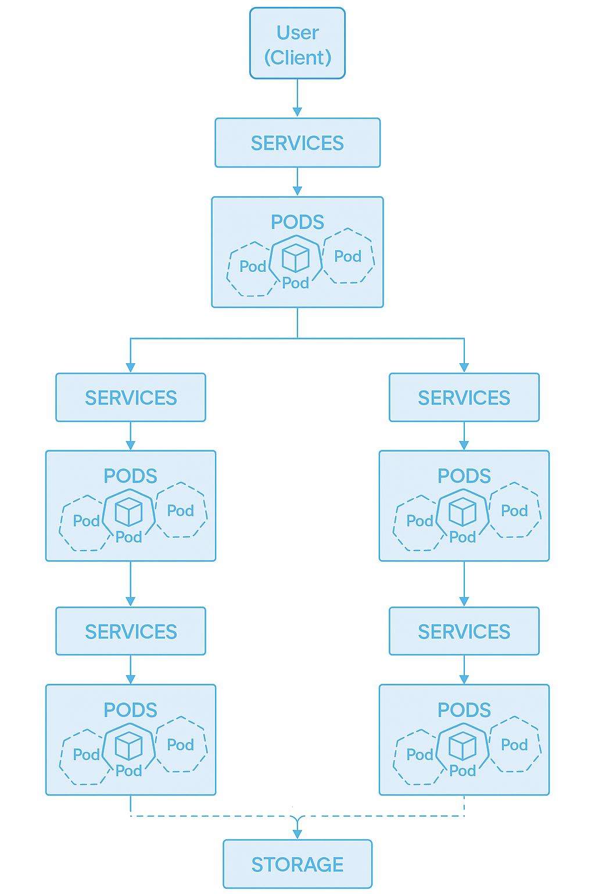
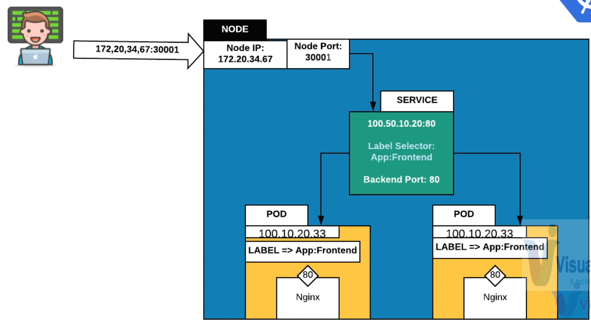
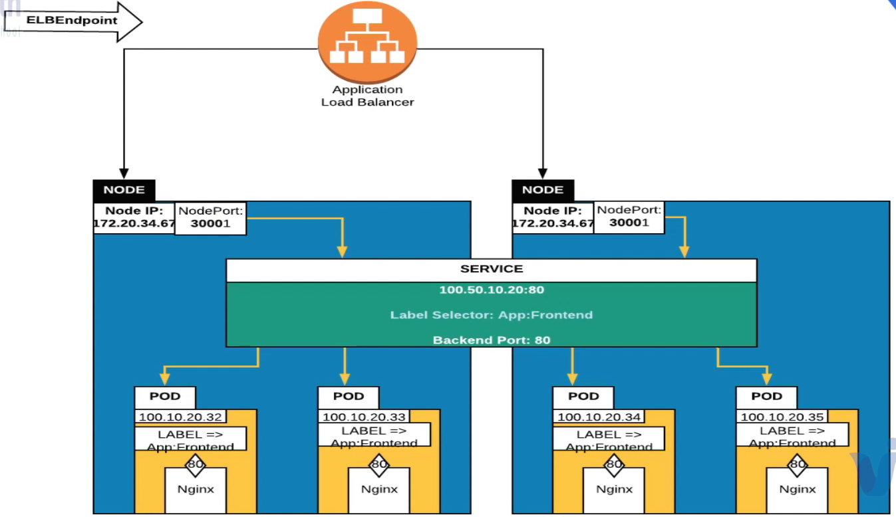
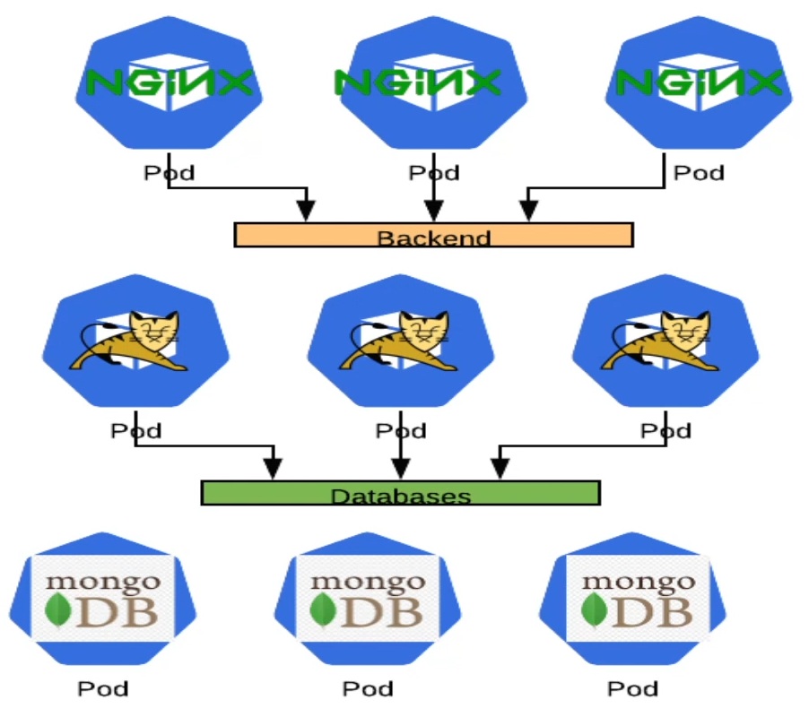
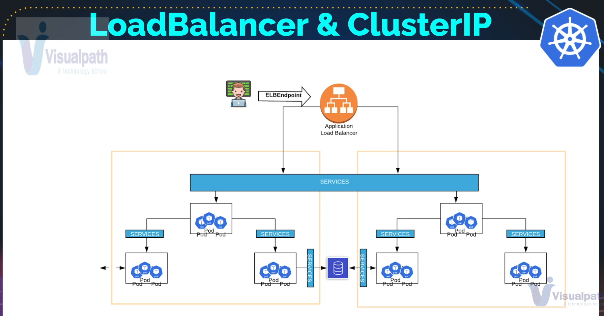
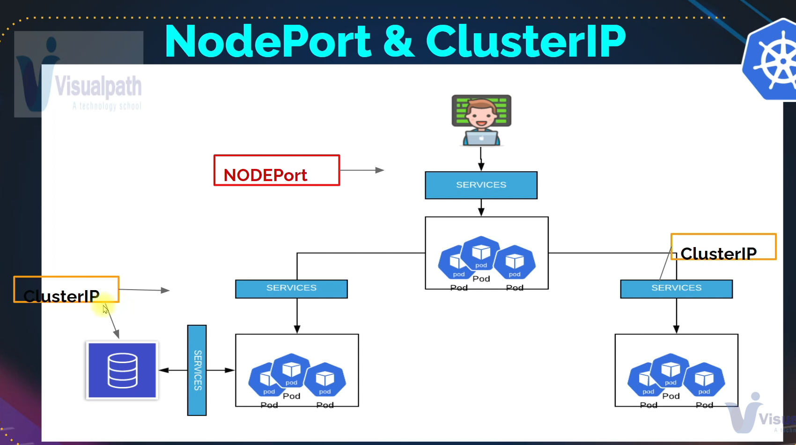

# Service



## Host Service In Kubernetes

- If you want to expose the application running inside a pod as a network service then you will need to host a service
- Similar to load balancers

## Info

Kubernetes Pods are mortal. They are born and when they die they are not resurrected. If you use a Deployment to run your app, it can destroy and create Pods dynamically.

Each Pod gets its own IP address, however the set of Pods running in one moment in time could be different from the set of Pods running that application a moment later.

This leads to a problem: if some set of Pods(call them backenders) have functionality to other set of Pods(call them frontenders) inside your cluster, how do the frontenders find out keep track of which IP address to connect to, so that the frontend can use the backend part of the workload?

Enter Services.

## Service Commands

Create
```
kubectl create -f service-defs.yml
```

Get info
```
kubectl get svc
```

Delete
```
kubectl delete svc <service name>
```

## Services

### NodePort

- Similar to Port mapping in Docker
- A host port and map it to a container port
- Not for production



Service example for the file `service-defs.yml`:
```
apiVersion: v1
kind: Service
  name: webapp-service
spec:
  type: NodePort #  <-- Service
  ports:
  - targetPort: 80
    port: 80
    nodePort: 30005
    protocol: TCP
  selector:
    app: frontend # <-- This is a Pod label
```

#### Example

Pod reference `vproapppod.yaml`:

```
apiVersion: v1
kind: Pod
metadata:
  name: vproapp
  labels:
    app: vproapp
spec:
  containers:
    - name: appcontainer
      image: imranvisualpath/freshtomapp:V7
      ports:
        - name: vproapp-port
          containerPort: 8080
```

NodePort Service ``vproapp-nodeport.yaml`:

```
apiVersion: v1
kind: Service
metadata:
  name: helloworld-service
spec:
  ports:
  - port: 8090
    nodePort: 30001
    targetPort: vproapp-port
    protocol: TCP
  selector:
    app: vproapp
  type: NodePort
```

```
kubectl create -f vproapp-nodeport.yaml
```

```
kubectl get svc
kubectl describe svc <nodeport-service-name>
```

output example
```
IP: 200.20.200.200 <-- static ip of your service
Endpoints: 100.10.1.1:8080 <-- your pod ip
```

```
svc describe pod | grep IP
```

Output will show same ip as on `endpoints` config value.

To access the TomApp Application use the IP adress of either master or any worker nodes
```
curl 200.20.200.200:30001
```

### LoadBalancer

- Expose to outside network for production usecases.



#### Example

Pod reference `vproapppod.yaml`:

```
apiVersion: v1
kind: Pod
metadata:
  name: vproapp
  labels:
    app: vproapp
spec:
  containers:
    - name: appcontainer
      image: imranvisualpath/freshtomapp:V7
      ports:
        - name: vproapp-port
          containerPort: 8080
```

NodePort Service ``vproapp-nodebalancer.yml`:

```
apiVersion: v1
kind: Service
metadata:
  name: helloworld-service
spec:
  ports:
  - port: 80
    targetPort: vproapp-port
    protocol: TCP
  selector:
    app: vproapp
  type: LoadBalancer
```

To access the TomApp Application use the IP adress of either master or any worker nodes

```
curl 200.20.200.200
```

### ClusterIP

- Internal network communication between pods.
- Example: Tomcat connecting to MySQL





#### Example

Pod reference `vproapppod.yaml`:

```
apiVersion: v1
kind: Pod
metadata:
  name: app-pod
  labels:
    app: backend
    project: infinity
spec:
  containers:
    - name: tomcat-container
      image: tomcat
      ports:
        - name: app-port
          containerPort: 8080
```

ClusterIP Service`tom-svc-clusterip.yml`:

```
apiVersion: v1
kind: Service
metadata:
  name: app-service
spec:
  type: ClusterIP
  ports:
    - targetPort: 8080
      port: 8080
      protocol: TCP
  selector:
    app: backend
```